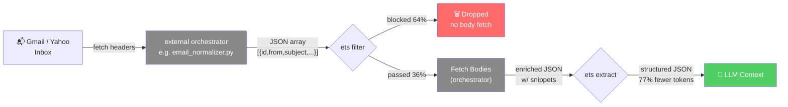
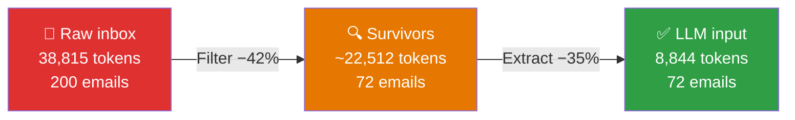

[](./Cargo.toml)
[](https://www.npmjs.com/package/@awsoft/ets)
[](./LICENSE)

# ETS — Email Token Saver

> Rules-based email pre-filter for OpenClaw. Classifies, compresses, and noise-cancels your inbox **before the LLM sees a single byte.**

---

## Overview

Email monitoring is one of the highest-token-cost tasks for an AI assistant. A 7-day Gmail window can easily contain 200 emails — most of them marketing, newsletters, shipping notifications, and other structured noise. Dumping all of that raw into an LLM is wasteful and expensive.

**ETS solves this with a two-stage, pre-LLM pipeline:**

1. **Filter** — a rules engine scores each email and drops known noise. No LLM involved. Takes ~5ms for 200 emails.
2. **Extract** — a template engine classifies survivors, pulls structured fields, assigns weighted category tags, and enforces a snippet policy that limits how much text the LLM sees.

**Real-world result on a 7-day Gmail window (200 emails):**

```
200 emails, ~38,815 raw tokens
        │
        ▼  Stage 1: Filter (rules engine, 5ms)
        │  128 emails blocked (64% block rate)
        ▼
72 survivors, bodies fetched
        │
        ▼  Stage 2: Extract (template engine, 2ms)
        │  127 templates, 10 tag categories, snippet policy
        ▼
LLM sees 72 emails → ~8,844 tokens

↓ 77.4% token reduction — 30,218 tokens saved
```

Neither stage calls the LLM. Both run in the same Rust binary in under 10ms.

---

## Architecture

```
┌─────────────────────────────────────────────────────────────────┐
│  ETS Plugin (@awsoft/ets)                                        │
│                                                                  │
│  index.ts (TypeScript wrapper)                                   │
│  ├── Reads config from openclaw.plugin.json                      │
│  ├── Resolves paths (rules, local-rules, templates, db)          │
│  ├── Registers 6 agent tools + 1 slash command                   │
│  └── Spawns `bin/ets` (Rust binary) via spawnSync               │
│                                                                  │
│  bin/ets (Rust binary — compiled from src/)                      │
│  ├── src/main.rs    — CLI: filter | extract | pipeline | stats   │
│  ├── src/filter.rs  — RuleEngine: score, bucket, hard-allow      │
│  ├── src/extractor.rs — TemplateEngine: detect, extract, tag     │
│  ├── src/db.rs      — SQLite: run history, rule hit counts       │
│  └── src/common.rs  — Shared utils (domain extraction)           │
│                                                                  │
│  email_rules.json       — bundled filter rules                   │
│  extractor_templates.json — 127 templates, 30 tag rules          │
│  ~/.openclaw/ets/ets.db — SQLite stats database                  │
└─────────────────────────────────────────────────────────────────┘
```

**Data flow (JSON in, JSON out):**

```
stdin: [{id, from, subject, date, snippet}, ...]
          │
          ▼ ets filter
{passed: [...], uncertain: [...], blocked: [...], stats: {...}}
          │
          ▼ ets extract
{emails: [{id, from, subject, type, tags, snippet, extracted}, ...], stats: {...}}
```

Or in a single pass:

```
stdin: [{...}] │ ets pipeline │ stdout: {emails: [...], stats: {...}}
```

The binary is a **stdin → stdout JSON processor**. It has no network access, no side effects (except SQLite stat writes), and no LLM calls.

---

## Installation

### Via OpenClaw (recommended)

```bash
openclaw plugins install @awsoft/ets
```

Restart the Gateway after installing:

```bash
openclaw gateway restart
```

### From source

```bash
git clone https://github.com/awsoft/ets.git ~/.openclaw/extensions/ets
cd ~/.openclaw/extensions/ets
source ~/.cargo/env
cargo build --release
cp target/release/ets bin/ets
```

> **Note:** `source ~/.cargo/env` is required if Rust was installed via `rustup` and your shell session doesn't have it on PATH yet.

### Verify

```bash
~/.openclaw/extensions/ets/bin/ets --version
# ets 1.4.0
```

---

## CLI Reference

All subcommands read from **stdin** and write to **stdout**. Global flags must come before the subcommand.

### Global flags

| Flag | Default | Description |
|------|---------|-------------|
| `--rules <path>` | `<plugin-dir>/email_rules.json` | Path to filter rules file |
| `--local-rules <path>` | _(none)_ | Path to local rules overrides (merged by ID) |
| `--templates <path>` | `<plugin-dir>/extractor_templates.json` | Path to extractor templates |
| `--db <path>` | `~/.openclaw/ets/ets.db` | SQLite database path |
| `--threshold-block <n>` | `-50` | Score ≤ this → blocked |
| `--threshold-allow <n>` | `50` | Score ≥ this → passed |

All flags can also be set via environment variables: `ETS_RULES_PATH`, `ETS_LOCAL_RULES_PATH`, `ETS_TEMPLATES_PATH`, `ETS_DB_PATH`.

---

### `ets filter`

Score and bucket a batch of emails.

**Input:** JSON array of email objects on stdin.

```json
[
  {"id": "abc123", "from": "alerts@amazon.com", "subject": "Your order has shipped", "date": "2026-03-07", "snippet": "Track your package..."},
  {"id": "def456", "from": "newsletter@groupon.com", "subject": "50% off today only!", "date": "2026-03-07", "snippet": "Don't miss these deals..."}
]
```

**Output:** Filter result JSON on stdout.

```json
{
  "passed":    [...],
  "uncertain": [...],
  "blocked":   [...],
  "stats": {
    "total": 2, "passed": 1, "blocked": 1, "uncertain": 0,
    "rules_loaded": 47, "elapsed_ms": 2
  }
}
```

**Flags:**

| Flag | Description |
|------|-------------|
| `--explain` | Add `matched_rules: [...]` to each email showing which rule IDs fired |
| `--threshold-block <n>` | Override block threshold for this run |
| `--threshold-allow <n>` | Override allow threshold for this run |

**Example:**

```bash
cat emails.json | bin/ets --local-rules ~/rules_local.json filter --explain
```

---

### `ets extract`

Classify, tag, and compress filter survivors.

**Input:** The full JSON object output by `ets filter` (with `passed`, `uncertain`, `blocked` keys).

**Output:**

```json
{
  "emails": [
    {
      "id": "abc123",
      "from": "alerts@amazon.com",
      "subject": "Your order has shipped",
      "date": "2026-03-07",
      "type": "shipping",
      "tags": {"travel": 0.3, "action_required": 0.2},
      "snippet": null,
      "snippet_policy_applied": "omitted",
      "source_bucket": "passed",
      "matched_template": "amazon-shipping",
      "extracted": {
        "carrier": "UPS",
        "tracking": "1Z9999W99999999999"
      }
    }
  ],
  "stats": {
    "total_in": 1, "blocked_dropped": 1,
    "extracted_structured": 1, "snippet_only": 0, "tags_only": 0,
    "snippet_cap": 300, "elapsed_ms": 1
  }
}
```

**Blocked emails are dropped** — they don't appear in the output at all. Only `passed` and `uncertain` buckets are processed.

**Flags:**

| Flag | Default | Description |
|------|---------|-------------|
| `--snippet-cap <n>` | `300` | Max chars for full-policy snippets |
| `--explain` | off | Include debug fields (`_matched_template`, etc.) |

---

### `ets pipeline`

Filter + extract in a single process invocation — no inter-process JSON serialization overhead.

**Input:** Raw email array (same as `ets filter`).  
**Output:** Same as `ets extract`.

```bash
cat emails.json | bin/ets pipeline --snippet-cap 300 --explain
```

This is the preferred mode for production use. It's faster than piping `filter | extract` and eliminates one JSON parse/serialize cycle.

---

### `ets stats`

Print cumulative run statistics from SQLite.

```bash
bin/ets stats
```

```json
{
  "total_runs": 42,
  "total_emails": 1847,
  "total_passed": 665,
  "total_blocked": 1009,
  "total_uncertain": 173,
  "rule_hits": [
    {"rule_id": "block-groupon", "hit_count": 87},
    {"rule_id": "allow-financial-security", "hit_count": 44}
  ]
}
```

---

### `ets sync-rules`

Sync all rule IDs from `email_rules.json` into the SQLite `rule_hits` table. Run this after manually editing the rules file to ensure the DB schema is current.

```bash
bin/ets sync-rules
```

---

## Filter Rules

Rules live in `email_rules.json` (bundled) and optionally `email_rules_local.json` (personal, gitignored). The two files are **merged by rule ID** at load time — local rules override bundled rules with the same ID, or add new ones.

### Schema

```json
{
  "rules": [
    {
      "id": "block-groupon",
      "action": "block",
      "weight": 80,
      "match": {
        "sender_domain": "groupon.com"
      },
      "reason": "Promo spam"
    }
  ]
}
```

| Field | Type | Required | Description |
|-------|------|----------|-------------|
| `id` | string | ✅ | Unique kebab-case identifier |
| `action` | `"allow"` \| `"block"` | ✅ | What to do when matched |
| `weight` | integer 1–100 | ✅ | Strength of signal |
| `match` | object | ✅ | Match criteria (see below) |
| `reason` | string | ✓ | Human-readable description |

### Match criteria

At most one key per rule is recommended. All specified keys in `match` are evaluated independently and scores accumulate.

| Key | Type | Matches against |
|-----|------|----------------|
| `sender_domain` | string | Exact domain from the `from` address (O(1) HashMap lookup) |
| `sender_exact` | string | Exact email address (O(1) HashMap lookup) |
| `sender_contains` | string | Substring match on address + display name (case-insensitive) |
| `subject_regex` | string | Regex match on `subject` field |
| `body_regex` | string | Regex match on `snippet` field |

### Scoring

Each email starts at score 0. Every matching rule adds (allow) or subtracts (block) its weight:

```
score += weight   (allow rules)
score -= weight   (block rules)
```

After all rules run:

| Score | Bucket |
|-------|--------|
| ≥ `threshold_allow` (default 50) | `passed` |
| ≤ `threshold_block` (default -50) | `blocked` |
| Between | `uncertain` (passed to extract stage) |

**Hard overrides:** Allow rules with `weight ≥ 90` set a `hard_allow` flag. A hard-allowed email goes straight to `passed` regardless of what block rules scored against it. Use this for critical senders (banks, your own domain, trusted contacts).

### Local rules merge

The `--local-rules` flag (or `localRulesPath` config) loads a second rules file and merges it into the bundled rules **by ID**:

- If a local rule has the same `id` as a bundled rule, the local version wins (full replacement).
- New IDs in the local file are added to the rule set.
- A missing local file is silently skipped — it's optional.

This lets you keep personal block rules (your spam senders) out of the shared repository.

---

## Extractor Templates

Templates live in `extractor_templates.json`. They define how to **detect** an email type, what **fields to extract**, what **tags** to assign, and (implicitly) what **snippet policy** to apply.

The engine loads all templates, sorts them by `priority` descending, and tests each email against them in order. **First match wins.** Unmatched emails get `type: "unclassified"` with default tags `{personal: 0.3, action_required: 0.2}`.

### Schema

```json
{
  "id": "amazon-shipping",
  "name": "Amazon Shipment Notification",
  "priority": 115,
  "type": "shipping",
  "detect": {
    "sender_domain": "amazon.com",
    "subject_regex": "(?i)(shipped|out for delivery|delivered|tracking)"
  },
  "tags": {
    "travel": 0.3,
    "action_required": 0.2
  },
  "extract": {
    "carrier": {
      "source": ["subject", "snippet"],
      "enum_map": {
        "(?i)UPS": "UPS",
        "(?i)USPS": "USPS",
        "(?i)FedEx": "FedEx"
      }
    },
    "tracking": {
      "source": "snippet",
      "regex": "([A-Z0-9]{12,22})"
    },
    "status": {
      "static": "shipped"
    },
    "order_hint": {
      "source": "subject",
      "max_chars": 60
    }
  }
}
```

### Detect rules

| Key | Matches when |
|-----|-------------|
| `sender_domain` | Email domain exactly equals this value (case-insensitive) |
| `sender_contains` | Full `from` string (address + display name) contains this substring |
| `subject_regex` | Subject matches this regex |
| `snippet_regex` | Snippet matches this regex |

**Default behavior:** ALL specified detect conditions must match (AND logic). This avoids false positives — a shipping template with both `sender_domain` and `subject_regex` will only fire for shipping emails from that specific sender.

> **Historical note:** An `any: true` flag was previously supported (OR logic) but was removed in v1.4.0 after it caused false positive matches on generic patterns. Templates that need OR logic should be split into multiple templates at different priorities.

### Extract field definitions

Each field in `extract` is an object with one primary extraction strategy:

| Strategy | Fields | Behavior |
|----------|--------|----------|
| **static** | `static: <value>` | Always returns the given value |
| **regex** | `regex: "<pattern>"` | Returns capture group 1 (or group 0 if no groups) |
| **enum_map** | `enum_map: {pattern: value}` | First matching pattern wins, returns its value |
| **truncate** | `max_chars: <n>` (no regex/enum) | Returns `source` text truncated to `max_chars` bytes |

All strategies accept a `source` field:

```json
"source": "snippet"           // single source
"source": ["subject", "snippet"]  // array: tries in order, uses first non-empty
```

Valid source values: `"subject"`, `"snippet"`, `"sender"`, `"from_name"`.

`max_chars` applies to any strategy — it byte-limits the extracted value. Truncation is UTF-8-safe (never splits a multi-byte character).

### Valid email types

`"shipping"`, `"order_confirm"`, `"billing"`, `"job"`, `"financial_alert"`, `"calendar_invite"`, `"subscription"`, `"travel"`, `"school_notice"`, `"unclassified"`

### Priority guide

| Priority | Use for |
|----------|---------|
| ≥ 110 | Specific sender domain **+** specific subject regex (e.g. UPS shipping, Amazon orders) |
| 100–109 | Any email from a known sender domain |
| 75–99 | High-confidence generic type (financial alerts, job emails, calendar invites) |
| 50–74 | Broad generic pattern (generic shipping, billing, order confirms) |
| < 50 | Fallback / catch-all |

---

## Tag Rules

Tag rules are **cross-cutting adjustments** that fire regardless of which template matched. They look at subject and snippet text and boost tag scores via **max merge** (scores only go up, never down).

### Schema

```json
{
  "tag_rules": [
    {
      "id": "tag-urgent",
      "match": {
        "subject_regex": "(?i)(urgent|action required|immediate action|expires today)"
      },
      "adjust": {
        "action_required": 0.9,
        "personal": 0.3
      }
    }
  ]
}
```

### How max merge works

If a shipping template sets `action_required: 0.2` and a tag rule fires matching `"urgent"` in the subject, the final value is `max(0.2, 0.9) = 0.9`. The base template value is never lowered.

### Tag categories

All 10 recognized categories (values 0.0–1.0, zero values are dropped from output):

| Category | Meaning |
|----------|---------|
| `action_required` | Email needs a response or user action |
| `personal` | From a real person, not an automated system |
| `financial` | Money, banking, billing related |
| `investment` | Stocks, markets, portfolio, dividends |
| `job` | Employment, recruiting, career |
| `kids` | School, youth sports, children's activities |
| `travel` | Flights, hotels, car rentals, itineraries |
| `marketing` | Promotional or advertising |
| `social` | Social platforms, community notifications |
| `newsletter` | Informational digest, no action needed |

### Bundled tag rules (v1.4.0)

30 tag rules ship by default, including:

- `tag-urgent` — subject contains "urgent", "action required", "expires today" → `action_required: 0.9`
- `tag-personal-greeting` — subject starts with "re:", "hi ", "hey " → `personal: 0.8`
- `tag-investment` — subject contains "stock", "portfolio", "dividend" → `investment: 0.85`
- `tag-kids-school` — subject contains `\bschool\b`, "grade N", "permission slip" → `kids: 0.85`
- `tag-kids-sports` — "game reminder", "practice canceled", "tournament" → `kids: 0.7`
- `tag-travel` — "flight", "boarding pass", "hotel confirmation" → `travel: 0.85`

> **Tip for generic words:** Tag rule subject regexes should use `\b` word boundaries (e.g. `\bschool\b` not `school`) to prevent false positives on unrelated subjects containing the word as a substring.

---

## Snippet Policy

The final snippet shown to the LLM is determined by the email's computed tag scores:

| Policy | Condition | LLM receives |
|--------|-----------|--------------|
| `full` | `action_required ≥ 0.6` **OR** `personal ≥ 0.7` | Full snippet up to `snippet_cap` chars |
| `short` | `action_required ≥ 0.3` **OR** `personal ≥ 0.4` **OR** `investment ≥ 0.7` | First 100 chars |
| `omitted` | Everything else | `null` — zero snippet tokens |

**Examples:**
- A fraud alert from your bank: `action_required: 0.9` → **full snippet**
- "Hey, can you call me?" from a real person: `personal: 0.8` → **full snippet**
- UPS delivered package: `action_required: 0.2, travel: 0.3` → **omitted** (extracted fields only)
- Investment newsletter: `investment: 0.85` → **100 chars**
- Groupon promo (if it survived filtering): `marketing: 0.9` → **omitted**

The `snippet_cap` (default 300) bounds the full-policy snippet. The `short` policy is always capped at 100 chars, regardless of `snippet_cap`.

---

## Pipeline Flow



---

## Token Reduction

Token savings come from two independent sources:

### Source 1: Filtering (~42% reduction)

The rules engine drops emails it recognizes as noise. These never get their bodies fetched, saving both network calls and tokens. In the 7-day benchmark, 64% of emails were blocked outright.

### Source 2: Extraction (~35% reduction)

Even for emails that survive filtering, the extraction stage compresses them significantly:
- Structured emails (shipping, billing, orders) get key fields extracted and snippet omitted
- Tag-based snippet policy cuts or eliminates body text for low-signal emails
- Blocked emails are dropped from the output entirely

### Combined effect

The two stages compound multiplicatively:

```
raw tokens × (1 - 0.42 filter) × (1 - 0.35 extract) ≈ raw tokens × 0.37
```

Real-world overhead is slightly higher because uncertain emails still get bodies fetched. Actual measured reduction: **77.4%**.



---

## Testing & Benchmarks

### Test suite

ETS ships with **143 tests** (124 unit + 19 CLI integration), all passing.

```bash
cd ~/.openclaw/extensions/ets
source ~/.cargo/env
cargo test
```

Expected output:
```
test result: ok. 143 passed; 0 failed; 0 ignored
```

**Test coverage by module:**

| Module | Tests | Coverage |
|--------|-------|---------|
| `filter.rs` | 47 | Rules loading, all 5 match types, scoring accumulation, hard-allow, threshold bucketing, explain mode, empty/null safety, rule hit counting |
| `extractor.rs` | 68 | Template loading, priority sort, all detect modes, all field extraction strategies, UTF-8-safe truncation (emoji, CJK, accented chars), snippet policy, tag computation, max-merge, from_name parsing, batch stats |
| `db.rs` | 9 | SQLite open/create, run recording, stats query, rule sync, concurrent transactions |
| CLI integration | 19 | All subcommands (`filter`, `extract`, `pipeline`, `stats`, `sync-rules`), explain mode, `--local-rules` merge, threshold flags, malformed input handling |

### Real-world benchmarks

Measured on a live Gmail inbox over a 7-day window. All numbers are token estimates using the standard `len(json) / 4` approximation for English text.

#### Extraction-only (no filter rules, all emails pass)

Consistent ~35% reduction purely from template extraction and snippet policy:

| Timeframe | Emails | Raw Tokens | After ETS | Reduction |
|-----------|--------|------------|-----------|-----------|
| 1 day | 41 | 7,367 | 4,812 | 34.7% |
| 3 days | 103 | 18,785 | 12,241 | 34.8% |
| 7 days | 202 | 36,983 | 23,920 | 35.3% |

The consistency across timeframes (34.7%–35.3%) confirms the extraction reduction is structural, not noise.

#### Full pipeline (filter + extract)

| Timeframe | Emails Fetched | Emails Blocked | Raw Tokens | Output Tokens | Reduction |
|-----------|---------------|----------------|------------|---------------|-----------|
| 7 days | 200 | 128 (64%) | 38,815 | 8,844 | **77.4%** |

**30,218 tokens saved** in a single 7-day window.

#### Breakdown: where savings come from

```
38,815 raw tokens
  │
  ├─ 64% block rate → ~24,841 tokens eliminated by filtering
  │
  └─ 36% survivors (72 emails) → bodies fetched → ~13,974 tokens
          │
          └─ extraction compresses to 8,844 tokens (37% of survivor cost)

Combined: 38,815 → 8,844 = 77.4% reduction
  Filter contribution:  ~42 percentage points
  Extract contribution: ~35 percentage points
```

#### Classification accuracy

On the 202-email 7-day window:
- **201 of 202 classified** — 16 distinct email types detected
- **1 unclassified** — a personal email from a real person (correctly assigned `personal: 0.8`, received full snippet, just no template match needed)
- **Zero false positives** reported — no important emails blocked

---

## OpenClaw Plugin Integration

### Config

Add to your OpenClaw config under `plugins.entries.ets.config`:

```json
{
  "plugins": {
    "entries": {
      "ets": {
        "config": {
          "rulesPath": "~/.openclaw/extensions/ets/email_rules.json",
          "localRulesPath": "~/.openclaw/workspace/scripts/email_rules_local.json",
          "templatesPath": "~/.openclaw/extensions/ets/extractor_templates.json",
          "dbPath": "~/.openclaw/ets/ets.db",
          "blockThreshold": -50,
          "allowThreshold": 50,
          "snippetCap": 300
        }
      }
    }
  }
}
```

| Config key | Default | Description |
|------------|---------|-------------|
| `rulesPath` | `<plugin-dir>/email_rules.json` | Bundled filter rules |
| `localRulesPath` | _(none)_ | Personal rules file (merged at runtime, gitignored) |
| `templatesPath` | `<plugin-dir>/extractor_templates.json` | Extractor templates |
| `dbPath` | `~/.openclaw/ets/ets.db` | SQLite stats database |
| `blockThreshold` | `-50` | Score at or below this → blocked |
| `allowThreshold` | `50` | Score at or above this → passed |
| `snippetCap` | `300` | Max chars for full-policy snippets |

### Registered tools

| Tool | Optional | Description |
|------|----------|-------------|
| `ets_filter` | ✅ (binary required) | Filter email array → passed/blocked/uncertain |
| `ets_extract` | ✅ (binary required) | Extract, tag, and compress filter output |
| `ets_add_rule` | ✅ (binary required) | Add a new filter rule + sync to SQLite |
| `ets_list_rules` | ❌ (always available) | List current rules (read-only, no binary needed) |
| `ets_stats` | ✅ (binary required) | Get run statistics from SQLite |
| `ets_add_extractor` | ✅ (binary required) | Add a new extractor template |

Optional tools fail gracefully with a clear error message if the binary isn't built. `ets_list_rules` always works since it reads JSON directly.

### Slash commands

```
/ets stats     — Filter statistics from SQLite
/ets rules     — List all allow and block rules
/ets pipeline  — Show pipeline config and engine status
/ets version   — Version, rule count, template count
```

---

## Email Normalizer Script

`~/.openclaw/workspace/scripts/email_normalizer.py` is the **orchestration layer** that ties Gmail/Yahoo fetching to ETS. It's what the agent runs during email check heartbeats.

### What it does

```
1. Fetch headers (gog gmail search / himalaya envelope list)
2. Run ETS filter on all headers
3. Fetch bodies ONLY for survivors (gog gmail thread get --json)
4. Strip HTML, CSS, URLs, tracking pixels from bodies
5. Run ETS extract on enriched survivors
6. Return LLM-ready JSON with token tracking stats
```

### Usage

```bash
python3 scripts/email_normalizer.py [OPTIONS]

Options:
  --source {yahoo,gmail,all}   Which inbox(es) to fetch (default: all)
  --since 1h|2h|24h            Gmail newer_than filter (default: 1h)
  --limit INT                  Max envelopes per source (default: 30)
  --snippet-cap INT            Max chars for full snippets (default: 300)
  --explain                    Pass --explain to ETS extract (debug mode)
```

### Output format

```json
{
  "checked_at": "2026-03-07T01:30:00+00:00",
  "since": "24h",
  "sources": {
    "gmail": {"fetched": 41, "blocked": 26, "passed": 15}
  },
  "pipeline": {
    "total_fetched": 41,
    "blocked": 26,
    "passed_to_llm": 15,
    "block_rate": 0.63
  },
  "tokens": {
    "raw_all": 7367,
    "raw_after_filter": 4200,
    "llm_output": 1840,
    "saved_total": 5527,
    "saved_by_filter": 3167,
    "saved_by_extract": 2360,
    "reduction_pct": 75.0
  },
  "emails": [
    {
      "id": "gmail-18e4a...",
      "from": "security@paypal.com",
      "subject": "Unusual activity on your account",
      "date": "2026-03-07",
      "type": "financial_alert",
      "tags": {"action_required": 0.9, "financial": 0.8},
      "snippet": "We noticed a sign-in from a new device...",
      "snippet_policy_applied": "full",
      "matched_template": "paypal-security",
      "source_bucket": "passed"
    }
  ]
}
```

### Gmail body fetch

The script fetches bodies via `gog gmail thread get <id> --json`, which returns the full MIME payload. It walks the part tree preferring `text/plain` over `text/html`, then runs the result through `strip_html()` which removes:

- HTML tags
- CSS (inline, block, `@media`, comments)
- URLs
- Tracking tokens (`%TOKEN%` patterns)
- Boilerplate phrases (unsubscribe, privacy policy, all rights reserved)

This prevents token-expensive HTML markup from reaching the LLM even when the email body is fetched.

### Token estimation

The script estimates tokens as `len(json_string) / 4` — the standard English-text approximation. For `blocked` emails (bodies never fetched), it uses the average survivor body size as a proxy to compute a realistic "what would have happened without ETS" baseline.

---

## Adding Rules

### When to use local rules vs bundled rules

| Situation | Where to put it |
|-----------|----------------|
| Personal spam senders (specific to your inbox) | `email_rules_local.json` |
| Block rules for brands only you care about | `email_rules_local.json` |
| Universal allow rules (financial security, job offers) | `email_rules.json` |
| Allow rules for widely-used services | `email_rules.json` |

Local rules are gitignored and never published. Bundled rules ship with the plugin.

### Via agent tool

```
Add a rule to block all emails from Groupon
```

Or explicitly:

```js
ets_add_rule({
  id: "block-groupon",
  action: "block",
  weight: 80,
  match: { sender_domain: "groupon.com" },
  reason: "Promo spam, never actionable"
})
```

The tool validates the rule, appends it to `email_rules.json`, and runs `sync-rules` to update SQLite.

### Via direct file edit

Edit `email_rules.json` (bundled) or your local rules file and add an entry to `rules[]`:

```json
{
  "id": "block-groupon",
  "action": "block",
  "weight": 80,
  "match": {
    "sender_domain": "groupon.com"
  },
  "reason": "Promo spam"
}
```

Then sync to SQLite (only needed for stats tracking):

```bash
bin/ets sync-rules
```

### Choosing weight

| Weight | Meaning |
|--------|---------|
| 90–100 | Very strong signal. Allow rules at this weight become **hard overrides** |
| 70–89 | High confidence. Single rule usually pushes past threshold |
| 50–69 | Moderate. Reaches threshold on its own, can be cancelled by opposing rules |
| 30–49 | Weak signal. Requires corroborating rules to cross threshold |
| 1–29 | Nudge only. Combined with other rules |

### Rule ID conventions

Use kebab-case: `block-groupon`, `allow-mybank`, `block-linkedin-newsletters`. Must be unique across bundled + local rules.

---

## Adding Templates

### When to add a template

Add a template when:
- You keep seeing emails of a type that shows up as `unclassified`
- A sender's emails are matching a wrong generic template (add a higher-priority specific one)
- You want structured field extraction (order numbers, amounts, tracking) from a specific service

### Via agent tool

```js
ets_add_extractor({ template: {
  "id": "etsy-order",
  "name": "Etsy Order Confirmation",
  "priority": 105,
  "type": "order_confirm",
  "detect": {
    "sender_domain": "etsy.com",
    "subject_regex": "(?i)(order confirmed|you bought|receipt)"
  },
  "tags": {
    "financial": 0.3,
    "action_required": 0.1
  },
  "extract": {
    "order_number": {
      "source": ["subject", "snippet"],
      "regex": "#(\\d{8,})"
    },
    "total": {
      "source": "snippet",
      "regex": "\\$[\\d,]+\\.?\\d*"
    },
    "shop": {
      "source": "snippet",
      "regex": "(?:from|shop:)\\s+([A-Za-z0-9 ]{2,40})"
    },
    "item_hint": {
      "source": "snippet",
      "max_chars": 80
    }
  }
}})
```

### Common patterns

**Known sender, specific subject (highest priority):**
```json
"detect": {
  "sender_domain": "chase.com",
  "subject_regex": "(?i)(fraud alert|unusual activity|account locked)"
}
```

**Known sender, any email (medium priority):**
```json
"detect": {
  "sender_domain": "github.com"
}
```

**Generic subject pattern (lower priority):**
```json
"detect": {
  "subject_regex": "(?i)(your (order|purchase) (has shipped|is on its way|confirmed))"
}
```

### Snippet policy tuning via tags

The tags you assign on a template directly control how much the LLM sees:

```json
// User gets full body — high action_required
"tags": {"action_required": 0.8, "financial": 0.9}

// User gets 100 chars — medium signal
"tags": {"action_required": 0.4, "financial": 0.6}

// User gets nothing beyond extracted fields — pure noise
"tags": {"marketing": 0.9, "newsletter": 0.8}
```

### Avoid `any: true`

The `any` flag (OR detection logic) was removed in v1.4.0 after causing false positives. If you need OR logic, create two separate templates — one for each sender you want to target — at appropriate priorities. This is always more precise.

---

## Technical Notes

### Binary I/O

- Reads from stdin, writes to stdout (JSON)
- stderr used for diagnostic messages (`[ETS] Loaded 65 local rules...`)
- Exit code 0 on success, non-zero on error
- Max buffer: 50MB (sufficient for large email batches)

### Path resolution

When invoked as `<plugin-dir>/bin/ets`, the binary infers `<plugin-dir>` from its own path (walks up two levels from executable). Default paths for rules and templates files use this resolved plugin root. Override with `--rules`, `--templates`, or env vars.

### SQLite database

The database at `~/.openclaw/ets/ets.db` (created on first run) tracks:
- Per-run stats (total, passed, blocked, uncertain)
- Per-rule hit counts across all runs

Used by `/ets stats` and `ets_stats` tool. Not required for filter/extract to work — stats recording failure is silent.

### UTF-8 safety

All text truncation (snippet caps, field `max_chars`) uses byte-boundary-safe slicing. The `safe_truncate()` function walks backward from the target byte position to find a valid UTF-8 character boundary, preventing panics on emoji, CJK characters, and other multi-byte sequences.

### Performance

Benchmarked on 200 emails:
- `ets filter`: ~5ms
- `ets extract`: ~2ms  
- `ets pipeline`: ~6ms (single process, no subprocess overhead)

The binary pre-compiles all regex patterns at load time and uses HashMaps for O(1) domain and exact-sender lookups.

---

## Repository

- **GitHub:** https://github.com/awsoft/ets
- **npm:** `@awsoft/ets` (v1.4.0)
- **Rust edition:** 2021
- **Dependencies:** `serde`, `serde_json`, `regex`, `rusqlite` (bundled SQLite), `clap`, `anyhow`, `dirs`

---

## License

MIT
