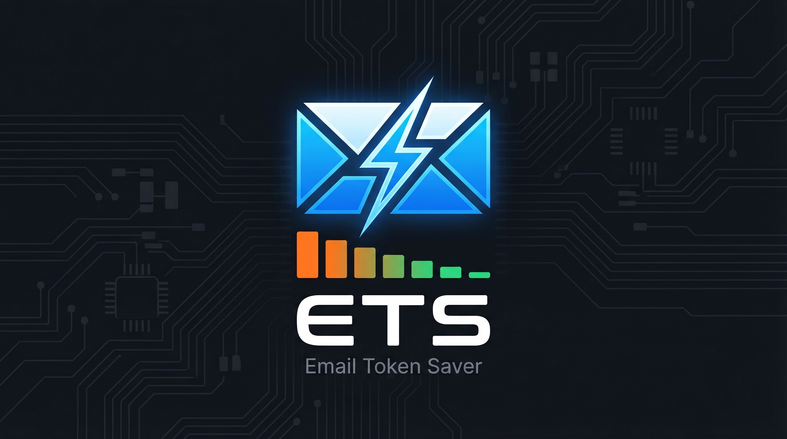

[](https://www.npmjs.com/package/@awsoft/ets)
[](./LICENSE)

# ETS — Email Token Saver
> Rules-based email pre-filter for OpenClaw. Strips noise, extracts structure, and categorizes intent — before the LLM sees a single byte.

---

## What it does

**Without ETS:** Your hourly email cron feeds 35 raw emails (~12,000 tokens) directly to the LLM.

**With ETS:** A two-stage pipeline eliminates noise and condenses what remains.

```
Raw inbox (35 emails, ~12,000 tokens)
        │
        ▼
  [Stage 1] Filter        ← rules engine, <5ms, no LLM
  Block known noise
  24 blocked → gone
        │
        ▼
  [Stage 2] Fetch bodies  ← only for 11 survivors
        │
        ▼
  [Stage 3] Extract +     ← template engine, <2ms, no LLM
  Categorize
  Tags: action_required, personal, financial...
  Snippet policy: full / 100 chars / omitted
        │
        ▼
  LLM sees 11 emails      ← ~400 tokens total
  compact tagged JSON
```

**Result: ~80-95% token reduction on email monitoring.**

---

## Install

```bash
openclaw plugins install @awsoft/ets
```

Restart the Gateway after installing. The binary compiles automatically on install via the `postinstall` script (requires Rust/cargo).

---

## Requirements

- OpenClaw 2026.x+
- Rust/cargo (for native binary compilation on install)
- Python 3.8+ is **not** required — ETS is Rust-only as of v1.3.0

---

## How it works

### Stage 1 — Filter

The rules engine scores each email against a list of block/allow rules. Each rule has:
- A **match** condition: `sender_domain`, `sender_contains`, `subject_regex`, `body_regex`
- An **action**: `block` or `allow`
- A **weight**: 1–100 (how strongly it influences the score)

Emails scoring below the block threshold (`-50`) are dropped. Emails above the allow threshold (`50`) pass. Everything in between is `uncertain` — passed to Stage 3 with lower confidence.

Hard overrides: allow rules with weight ≥ 90 pass regardless of block score.

### Stage 2 — Extract

The template engine matches each surviving email against 20+ built-in extraction templates, in priority order (highest first). Built-in templates cover:

| Sender | Types |
|--------|-------|
| Amazon, Walmart, eBay | shipping, order_confirm |
| UPS, FedEx, USPS, DHL | shipping |
| PayPal, Stripe | billing |
| GitHub | notifications |
| Generic | financial_alert, subscription, job, billing, calendar_invite, shipping, order_confirm |

Each matched template extracts structured fields: tracking numbers, amounts, order numbers, alert types, etc. — no regex hand-writing required for supported senders.

### Stage 3 — Categorize (v1.3.0)

After extraction, every email gets a **weighted tag score** across 10 categories:

| Tag | Meaning |
|-----|---------|
| `action_required` | Drew needs to do something |
| `personal` | From a real person (not automated) |
| `financial` | Money, banking, billing |
| `investment` | Stocks, markets, portfolio |
| `job` | Employment, recruiting, career |
| `kids` | School, sports, kids activities |
| `travel` | Flights, hotels, car rentals |
| `marketing` | Promotional / advertising |
| `social` | Social platforms, community |
| `newsletter` | Informational digest, no action needed |

Tags are computed from two sources:
1. **Template base tags** — each extractor template declares base weights for its type (e.g. `financial_alert` starts with `action_required: 1.0, financial: 1.0`)
2. **Cross-cutting tag rules** — 10 subject/snippet regex rules that adjust scores across any email type (e.g. `"urgent"` in subject → `action_required: 0.9`)

Adjustments use **max merge**: a tag can only go up, never down.

---

## Snippet policy

The final tag scores drive snippet inclusion — zero configuration needed:

| Policy | Condition | Tokens sent to LLM |
|--------|-----------|---------------------|
| `full` | `action_required ≥ 0.6` OR `personal ≥ 0.7` | Full body (up to snippet cap) |
| `short` | `action_required ≥ 0.3` OR `personal ≥ 0.4` OR `investment ≥ 0.7` | First 100 chars |
| `omitted` | Everything else | `null` — zero snippet tokens |

A UPS delivered notification gets `snippet: null`. A Chase fraud alert gets the full body. A "hey can you call me back?" email gets full body. A weekly newsletter gets 100 chars or nothing. All automatic.

---

## Configuration

Optional config under `plugins.entries.ets.config` in your OpenClaw config:

| Field | Default | Description |
|-------|---------|-------------|
| `rulesPath` | `<plugin-dir>/email_rules.json` | Path to rules file |
| `dbPath` | `~/.openclaw/ets/ets.db` | SQLite database for stats/audit |
| `blockThreshold` | `-50` | Score below this → blocked |
| `allowThreshold` | `50` | Score above this → passed |
| `snippetCap` | `300` | Max chars per full-policy snippet |

---

## Agent tools

| Tool | Side-effect | Description |
|------|-------------|-------------|
| `ets_filter` | ✓ writes SQLite | Filter raw email array → passed/blocked/uncertain buckets |
| `ets_extract` | — | Classify, extract fields, apply tags + snippet policy |
| `ets_add_rule` | ✓ modifies files | Add a block/allow rule to email_rules.json |
| `ets_list_rules` | — | List current rules (read-only) |
| `ets_stats` | — | Filter hit counts, run history |
| `ets_add_extractor` | ✓ modifies files | Add a new extraction template |

Tools marked with ✓ are registered as `optional: true` — they require the binary or file writes.

---

## Slash commands

| Command | Description |
|---------|-------------|
| `/ets stats` | Filter statistics (rule hits, pass/block rates) |
| `/ets rules` | List all allow and block rules |
| `/ets pipeline` | Pipeline config, engine status, template counts |
| `/ets version` | Version, binary status, rule count |

---

## Using the normalizer

`email_normalizer.py` is a full two-stage pipeline script that fetches from Yahoo and Gmail, runs ETS filter + extract, and outputs compact LLM-ready JSON.

```bash
# Full pipeline (Yahoo + Gmail, last 1h)
python3 scripts/email_normalizer.py --source all --since 1h

# Yahoo only, last 24h, limit 5
python3 scripts/email_normalizer.py --source yahoo --since 24h --limit 5

# Debug mode
python3 scripts/email_normalizer.py --source gmail --since 2h --explain
```

**Output format:**
```json
{
  "checked_at": "2026-03-06T21:36:00Z",
  "since": "1h",
  "sources": {
    "yahoo": {"fetched": 20, "blocked": 14, "passed": 6},
    "gmail": {"fetched": 15, "blocked": 10, "passed": 5}
  },
  "pipeline": {
    "total_fetched": 35,
    "blocked": 24,
    "passed_to_llm": 11,
    "block_rate": 0.69
  },
  "emails": [
    {
      "id": "yahoo-611234",
      "source": "yahoo",
      "type": "financial_alert",
      "from": "security@chase.com",
      "subject": "Unusual activity on your account",
      "date": "2026-03-06",
      "tags": {"financial": 1.0, "action_required": 1.0},
      "snippet": "We detected unusual sign-in activity...",
      "snippet_policy": "full",
      "extracted": {"alert_type": "unusual_activity", "urgent": true}
    },
    {
      "id": "yahoo-611235",
      "source": "yahoo",
      "type": "shipping",
      "from": "tracking@ups.com",
      "subject": "Your package was delivered",
      "date": "2026-03-06",
      "tags": {"travel": 0.3},
      "snippet": null,
      "snippet_policy": "omitted",
      "extracted": {"carrier": "UPS", "status": "delivered"}
    }
  ]
}
```

---

## Default rules

**ETS ships with zero block rules.** Block rules are inherently personal — what's noise for one person is signal for another. Only 6 universal **allow** rules ship by default, ensuring things like financial alerts and job emails always pass regardless of other scoring.

Add your own rules via agent:
```
"Block all emails from Groupon"
```

Or via tool:
```javascript
ets_add_rule({
  id: "block-groupon",
  action: "block",
  weight: 80,
  match: { sender_domain: "groupon.com" },
  reason: "Promo spam"
})
```

Or direct edit to `email_rules.json` — changes take effect on the next filter run. Keep personal rules in a local override file that never goes to npm: `scripts/email_rules_local.json`.

---

## Extending extractors

ETS extraction is fully template-driven. To add support for a new email type:

**Via agent (recommended):**
```
"Add an ETS extractor for Etsy order confirmation emails"
```

**Via tool:**
```javascript
ets_add_extractor({ template: { ... } })
```

**Template schema:**
```json
{
  "id": "etsy-order",
  "name": "Etsy Order Confirmation",
  "priority": 105,
  "type": "order_confirm",
  "detect": {
    "sender_domain": "etsy.com",
    "subject_regex": "(?i)(order confirmed|you bought|receipt)"
  },
  "tags": {"marketing": 0.1, "financial": 0.3, "action_required": 0.0},
  "extract": {
    "order_number": {"source": ["subject", "snippet"], "regex": "#(\\d{8,})"},
    "total": {"source": "snippet", "regex": "\\$[\\d,]+\\.?\\d*"},
    "shop": {"source": "snippet", "regex": "(?:from|shop:)\\s+([A-Za-z0-9 ]{2,40})"},
    "item_hint": {"source": "snippet", "max_chars": 80}
  }
}
```

**Priority guide:**
- `≥ 110` — Specific sender domain + specific subject (UPS shipping, Amazon orders)
- `100–109` — Site-specific: any email from a known sender domain
- `75–99` — High-confidence generic type (financial alerts, job emails)
- `50–74` — Broad generic type (generic shipping, billing)
- `< 50` — Fallback / catch-all

**`tags` field:** Set base weights for your template type. Cross-cutting `tag_rules` in `extractor_templates.json` will layer on top via max merge — you only need to cover what's unconditionally true for this template type.

---

## Native binary

ETS uses a compiled Rust binary (`bin/ets`) for all filter and extraction operations.

**Auto-compile on install:**
```bash
openclaw plugins install @awsoft/ets
# postinstall: cargo build --release && cp target/release/ets bin/ets
```

**Manual build:**
```bash
cd ~/.openclaw/extensions/ets
cargo build --release && cp target/release/ets bin/ets
```

**CLI usage:**
```bash
# Filter emails from stdin
echo '[{...}]' | bin/ets filter

# Extract from filter output
echo '[{...}]' | bin/ets filter | bin/ets extract --snippet-cap 300

# Single-pass pipeline (most efficient)
echo '[{...}]' | bin/ets pipeline --snippet-cap 300

# Stats
bin/ets stats

# Debug/explain mode
echo '[{...}]' | bin/ets filter --explain | bin/ets extract --explain
```

If the binary is missing, all tool calls throw:
```
ETS binary not found at bin/ets. Run: cargo build --release && cp target/release/ets bin/ets
```

Binary size: ~4.3MB (statically linked, stripped).

---

## Recommended cron integration

```
## TASK 1 — Email pipeline
Run the ETS normalizer:
`python3 /path/to/scripts/email_normalizer.py --source all --since 1h`

This returns compact categorized JSON. Review the `emails` array. Flag to #email channel
ONLY emails where:
- tags.action_required >= 0.6, OR
- tags.personal >= 0.6, OR
- tags.job >= 0.8, OR
- tags.kids >= 0.7, OR
- type == "financial_alert"

For flagged emails: include type, from, subject, and snippet (if present).
For shipping/order with action_required < 0.3: skip entirely.
If pipeline.passed_to_llm == 0 OR no emails meet thresholds: skip silently.
```

---

## License

MIT
